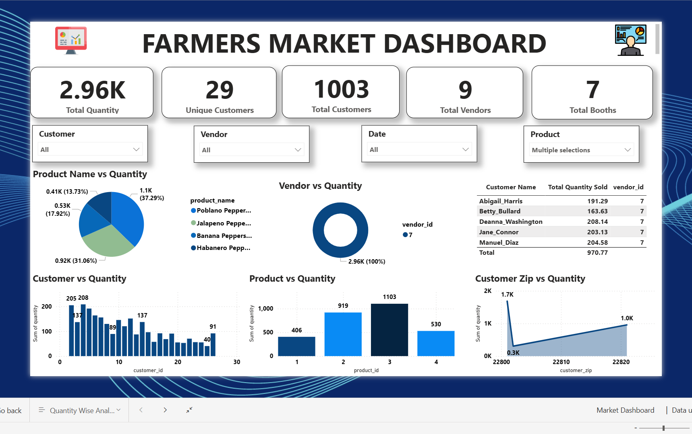

# Market Performance Analysis Dashboard 📊

## Project Overview
This project focuses on analyzing market dynamics using Power BI. It transforms raw market data into interactive visualizations to identify key performance indicators (KPIs) and consumer trends.

## Technical Features
- [cite_start]**Data Modeling:** Established complex table connections and metadata management[cite: 3, 153].
- [cite_start]**Custom Visuals:** Integrated **WordCloud** for qualitative data analysis.
- [cite_start]**UI/UX Design:** Applied professional themes (Tidal and Base Themes) for a clean user interface.
- [cite_start]**Security:** Implemented security bindings for data integrity[cite: 153].

## Tools Used
- **Power BI Desktop**
- **DAX (Data Analysis Expressions)**
- **Power Query** (M Language)

## Dashboard Preview

## How to View
1. Clone this repository.
2. Download and install [Power BI Desktop](https://powerbi.microsoft.com/desktop/).
3. Open `Dashboard/Market Dashboard.pbix`.
